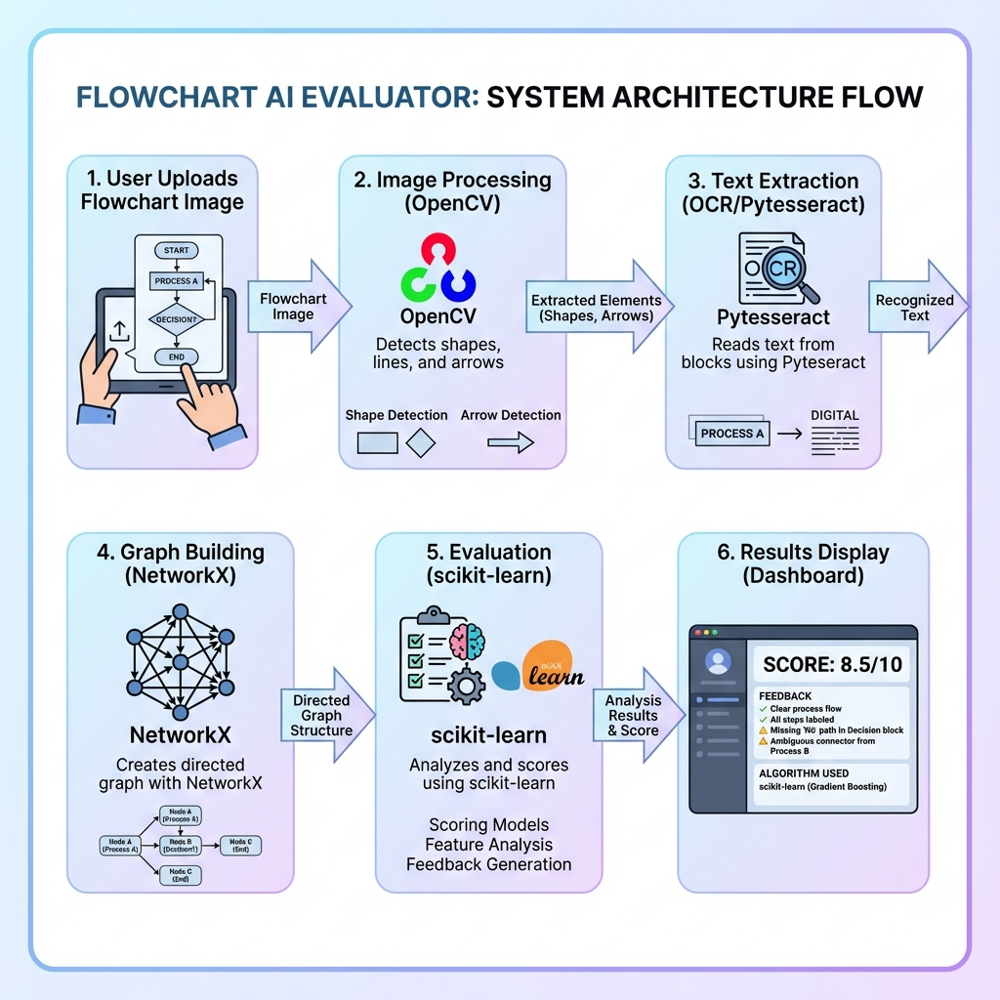

# Flowchart AI Evaluator 🤖



An **AI-powered web application** that automatically evaluates flowchart images. Upload any flowchart, and the system uses computer vision to detect shapes, OCR to read text inside blocks, and graph algorithms to generate an intelligent score with detailed feedback.

## 🎯 Features

- **Universal Analysis**: Works with any flowchart image (PNG, JPG, JPEG)
- **Computer Vision**: Automatically detects start/end nodes, process blocks, and decision diamonds
- **Text Recognition**: Uses **Pytesseract OCR** to read and understand text inside flowchart blocks
- **Intelligent Scoring**: Provides a score (0-100) based on structure, logic, and content
- **Modern Web Interface**: Clean, responsive UI with real-time feedback and glassmorphism design

## 🏗️ System Architecture

The project follows a modular pipeline:

1.  **Image Processing** (`OpenCV`): Detects shapes and arrows
2.  **Text Extraction** (`Pytesseract`): Reads text from blocks
3.  **Graph Construction** (`NetworkX`): Builds a directed graph representation
4.  **Evaluation** (`scikit-learn`): Semantically compares text and validates logic
5.  **Web Interface** (`Flask`): Displays results and visualization

## 🚀 Installation

### Prerequisites
- Python 3.8+
- [Tesseract OCR](https://github.com/tesseract-ocr/tesseract) installed on your system

### Steps

1.  **Clone the repository**
    ```bash
    git clone https://github.com/YashBawari18/Flowchart-Eval.git
    cd Flowchart-Eval
    ```

2.  **Install Dependencies**
    ```bash
    pip install -r requirements.txt
    ```

3.  **Install Tesseract OCR**
    - **macOS**: `brew install tesseract`
    - **Windows**: Download [installer](https://github.com/UB-Mannheim/tesseract/wiki)
    - **Linux**: `sudo apt-get install tesseract-ocr`

## 💻 Usage

1.  **Start the Server**
    ```bash
    python app.py
    ```

2.  **Open Web Interface**
    Open your browser and navigate to: `http://localhost:5001`

3.  **Upload & Analyze**
    - Drag and drop a flowchart image
    - Click "Analyze Flowchart"
    - View the generated algorithm, score, and feedback

## 📂 Project Structure

```
Flowchart-Eval/
├── app.py                 # Flask Data backend
├── src/
│   ├── image_processor.py # OpenCV shape detection
│   ├── text_extractor.py  # OCR text extraction
│   ├── graph_builder.py   # Graph algorithms
│   └── evaluator.py       # Scoring logic
├── static/                # Frontend assets (HTML/CSS/JS)
├── data/uploads/          # Temp storage for uploads
└── requirements.txt       # Python dependencies
```

## 🔍 How It Works

1.  **Shape Detection**: Identify rectangles (processes), diamonds (decisions), and ovals (start/end).
2.  **Text Extraction**: Extract text from each shape's bounding box.
3.  **Graph Building**: Link shapes based on spatial proximity and arrows.
4.  **Scoring**:
    - **Structural**: Checks for Start/End nodes, valid connections.
    - **Content**: Compares textual content using TF-IDF similarity.
    - **Logic**: Validates flow (e.g., decision blocks must have branches).

## ⚠️ Limitations

- **Handwriting**: Accuracy depends on handwriting clarity.
- **Complex Arrows**: Curved or crossing arrows may occasionally be misread.
- **Language**: Optimized for English text.

## 🤝 Contributing

Contributions are welcome! Please feel free to submit a Pull Request.

## 📜 License

This project is open source and available under the [MIT License](LICENSE).
